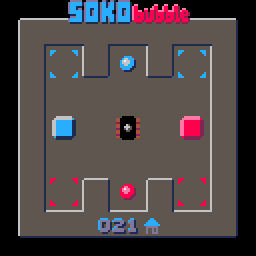

Sokobubble
==========

[Sokobubble][] is a Sokoban-like puzzle game for the [PICO-8][] fantasy console.
It is Sokoban with a twist!
The box pusher is always in a bubble.
Which boxes it can see and push depends on the bubble it is in.

Origin
------

The idea behind this game arose during the [Global Game Jam] in 2025, where the theme was 'bubble'.
The basic game was developed then and subsequently extended and polished.

[PICO-8]: https://www.lexaloffle.com/pico-8.php
[Sokobubble]: https://www.lexaloffle.com/bbs/?tid=146927
[Global Game Jam]: https://globalgamejam.org
